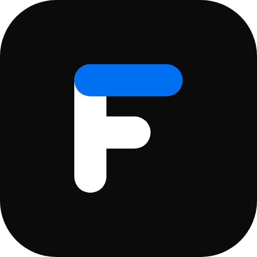

# Fora

**A fast, elegant viewer for conference programs — browse every session, star what matters, and carry your agenda across devices.**

English · [中文](README.zh-CN.md)

Fora turns a dense conference program into something you can actually navigate.
Pick a conference, explore its sessions, build a personal agenda by starring what
matters, and take it with you everywhere — no app to install.

## Features

- 🏛️ **Many conferences, one place** — pick one and dive straight into its full program.
- 🗓️ **The whole program** — keynotes, parallel sessions, speakers, committee and organizers, fully bilingual (中文 / English), with a time view that shows what's running in parallel.
- 🔴 **Live on the day** — what's on in every room right now, what starts next, and when your next starred talk begins.
- ⭐ **Your own agenda** — star the talks, sessions, and speakers you care about, and let **My Day** read a day as a plan: the free gaps, the room changes, and the clashes to decide between.
- 🔔 **Reminders** — an optional nudge before each session you starred.
- 🔍 **Search everything** — one box across talks, abstracts, speakers, affiliations, sessions, and committees.
- 🧭 **Plan for me** — a day without clashes, assembled from what interests you, with the reasoning behind every pick.
- 🗺️ **Topic map** — see what a conference is about at a glance, with similar talks on every talk.
- ✨ **AI summaries, on your terms** — one-line gists and topics, clearly marked as AI-generated, behind a single switch; the original text is always one tap away.
- 🔄 **Synced across devices** — sign in to keep your agenda everywhere; browsing needs no account.
- 📲 **Install & offline** — add it to your device and keep using it with no network.
- 📤 **Export & back up** — take your agenda to your calendar, or as a backup you can bring back later.
- 🖼️ **Share** — turn any session or talk into a clean, shareable image.
- 🌗 **Light & dark** — follows your system. No tracking.

## Development

Fora is open source. To run it locally, contribute, or add a conference, see
**[AGENTS.md](AGENTS.md)**.

## License

[MIT](LICENSE) © Super Lee & Claude. Cross-device sync is powered by
[`@repus/gist-sync`](https://www.npmjs.com/package/@repus/gist-sync).
